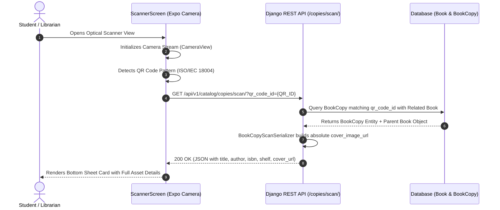
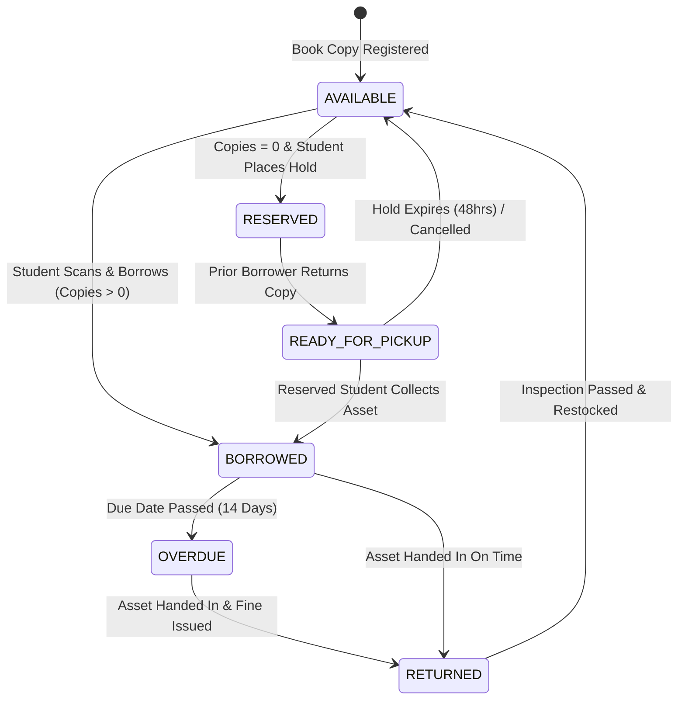

# Shelfie: An Automated Mobile Library Management & Physical Inventory System with Optical QR Resolution

**Degree / Project Level:** Final Year Undergraduate Computer Science & Software Engineering Thesis Project  
**Domain:** Mobile Computing, Distributed Systems, Database Management Systems, Computer Vision  
**Target Platform:** Cross-Platform Mobile Application (Android / iOS) & RESTful Web Microservices  

---

## Abstract

Traditional academic and institutional library management systems (LMS) often suffer from operational bottlenecks due to manual physical inventory tracking, latency in book circulation, and inefficient hold queues. **Shelfie** is a modern, cross-platform mobile and web application architecture designed to automate physical asset tracking, streamline book checkout/return workflows via high-speed optical QR code recognition, and enable real-time inventory management for librarians and administrators.

The system utilizes a **Decoupled Client-Server Architecture** comprising a high-performance **Django REST Framework (DRF)** backend API and a responsive **React Native / Expo (TypeScript)** mobile client. Key innovations include binary stream multipart image uploading, an automated First-In-First-Out (FIFO) reservation state machine, role-based permission control, and gesture-responsive mobile UI/UX paradigms.

---

## Table of Contents

1. [Architectural Overview & System Design](#1-architectural-overview--system-design)
2. [Technology Stack & Methodological Rationale](#2-technology-stack--methodological-rationale)
3. [System Process Flowcharts & State Machines](#3-system-process-flowcharts--state-machines)
4. [Database Schema & Data Modeling](#4-database-schema--data-modeling)
5. [Core Feature Implementation & Mechanics](#5-core-feature-implementation--mechanics)
6. [Installation, Configuration & Setup Guide](#6-installation-configuration--setup-guide)
7. [Verification & System Testing](#7-verification--system-testing)

---

## 1. Architectural Overview & System Design

The system adheres to the **Layered Clean Architecture** pattern, enforcing strict separation of concerns across presentation, application business logic, domain entities, and data persistence infrastructure.

```
       +-------------------------------------------------------------+
       |                  REACT NATIVE MOBILE CLIENT                 |
       |  (Presentation Layer: Navigation, Screens, UI Components)   |
       +------------------------------+------------------------------+
                                      |
                         HTTP / REST (JSON + Multipart)
                                      |
       +------------------------------v------------------------------+
       |                  DJANGO REST FRAMEWORK (DRF)                |
       |  (API Gateway, JWT Auth Middleware, Permission Handlers)    |
       +------------------------------+------------------------------+
                                      |
       +------------------------------v------------------------------+
       |                   DOMAIN & APPLICATION LOGIC                |
       |   (Catalog Engine, Transaction Pipeline, FIFO Hold Queue)   |
       +------------------------------+------------------------------+
                                      |
       +------------------------------v------------------------------+
       |                     DATA PERSISTENCE LAYER                  |
       |     (Object-Relational Mapping / SQLite / File Storage)     |
       +-------------------------------------------------------------+
```

### 1.1 Architectural Layers

1. **Presentation Layer (Mobile Client)**:
   - Written in **TypeScript** using **React Native** and **Expo**.
   - Organized into modular screens (`SmartCatalogScreen`, `LibrarianInventoryScreen`, `ScannerScreen`, `SplashScreen`, etc.) and reusable context providers (`AuthContext`).
   - Integrates hardware native modules (`expo-camera`, `expo-image-picker`) via unified JavaScript native bridges.

2. **Application / API Layer (Backend REST Server)**:
   - Built on **Python 3** and **Django REST Framework (DRF)**.
   - Enforces Stateless REST API endpoints operating under JSON data payloads and HTTP status codes (`200 OK`, `201 Created`, `400 Bad Request`, `403 Forbidden`, `404 Not Found`).
   - Implements custom permission classes (`IsLibrarian`, `IsStudent`, `IsAdminUser`) to enforce Role-Based Access Control (RBAC).

3. **Domain Layer (Business Rules & State Machine)**:
   - Manages book asset copy tracking, stock level updates, fine calculation, active checkout lifecycle, and reservation hold priority resolution.

4. **Infrastructure & Data Layer**:
   - Django Object-Relational Mapper (ORM) providing schema isolation and migration tracking (`apps/catalog`, `apps/transactions`, `apps/reservations`, `apps/fines`, `apps/users`).
   - Local and media storage persistence (`MEDIA_ROOT/book_covers/`) serving image assets over static HTTP paths.

---

## 2. Technology Stack & Methodological Rationale

### 2.1 Technology Selection Matrix

| Component | Technology | Version / Specification | Rationale for Selection |
|---|---|---|---|
| **Backend Language** | Python | 3.14+ | High readability, robust standard libraries, rapid domain modeling. |
| **Web Framework** | Django | 5.x | Enterprise-grade ORM, built-in migration handling, secure user management. |
| **API Engine** | Django REST Framework | 3.15+ | Declarative serializers, content negotiation, viewset abstractions. |
| **Mobile Framework** | React Native / Expo | SDK 54 | Unified codebase for iOS & Android, high rendering performance via Fabric. |
| **Language (Mobile)** | TypeScript | 5.x | Strict compile-time typing, prevention of null pointer / undefined reference runtime crashes. |
| **Optical Computer Vision** | Expo Camera | CameraView | Low-latency real-time video frame parsing for QR code detection. |
| **Media Capture** | Expo Image Picker | Camera & Gallery APIs | Cross-platform native camera and gallery integration for book cover uploads. |
| **State Persistence** | AsyncStorage | Native Key-Value | Lightweight client-side session state and onboarding preference storage. |

### 2.2 Methodological Rationale: Why These Methods?

#### A. RESTful API Architecture vs. GraphQL
- **Choice**: REST API via Django REST Framework.
- **Rationale**: REST APIs offer predictable HTTP caching headers, explicit status code semantics, and standardized `multipart/form-data` binary upload handling. While GraphQL reduces over-fetching, REST provides lower overhead for mobile binary streaming (e.g., direct multipart image creation) without requiring complex client-side GraphQL caching clients.

#### B. Direct Multipart File Uploads vs. Base64 Encoding
- **Choice**: Binary `multipart/form-data` file transmission directly stored via Django `ImageField`.
- **Rationale**: Encoding images as Base64 strings increases data payload size by approximately **33%** due to 6-bit to 8-bit character expansion, leading to memory bloat and higher latency on mobile networks. Multipart streaming transfers raw binary streams, reducing client memory consumption and server CPU decoding overhead.

#### C. Optical QR Code Scanning (ISO/IEC 18004) vs. Manual Input / RFID
- **Choice**: Optical QR Code camera scanning.
- **Rationale**: RFID infrastructure requires specialized, costly reader hardware attached to mobile devices. Barcode scanning standard 1D barcodes requires higher image resolution and orientation alignment. QR codes (ISO/IEC 18004) incorporate high error-correction algorithms (Reed-Solomon), allowing instant recognition under varying light conditions and angles using standard smartphone cameras without extra hardware cost.

#### D. Role-Based Access Control (RBAC) Architecture
- **Choice**: Declarative Django REST permissions (`IsStudent`, `IsLibrarian`, `IsAdmin`).
- **Rationale**: Enforcing permission logic at the API view boundary guarantees security even if client requests bypass mobile UI constraints. Students are restricted to catalog searches and personal loans/reservations, while Librarians gain full CRUD privileges for book inventory and checkout overrides.

---

## 3. System Process Flowcharts & State Machines

### 3.1 System Architecture Diagram

```mermaid
graph TD
    subgraph Mobile Client (React Native + Expo)
        A[Mobile User UI] --> B[Auth Context / Storage]
        A --> C[Camera Scanner Module]
        A --> D[Image Picker Engine]
        A --> E[Smart Catalog / Inventory View]
    end

    subgraph HTTP / REST API Gateway
        F[JSON / Multipart Request Pipeline]
        G[JWT Authentication & RBAC Rules]
    end

    subgraph Django Application Controllers
        H[BookViewSet / Catalog API]
        I[BookCopyViewSet / Scan Endpoint]
        J[TransactionViewSet / Checkout API]
        K[ReservationViewSet / Hold Queue]
    end

    subgraph Persistence Layer
        L[(Database ORM - SQLite)]
        M[FileSystem Media Storage /media/book_covers/]
    end

    E -->|HTTP GET/POST| F
    C -->|HTTP GET /scan/| F
    D -->|Multipart POST/PUT| F
    F --> G
    G --> H & I & J & K
    H & I & J & K --> L
    H --> M
```

### 3.2 Optical QR Scanning & Asset Retrieval Sequence



### 3.3 Book Copy Circulation & Hold Queue State Machine



---

## 4. Database Schema & Data Modeling

The relational database model consists of seven core entity tables optimized for normalization (3NF) and indexed retrieval.


---

## 5. Core Feature Implementation & Mechanics

### 5.1 Real-Time Optical QR Scanning
- **Implementation**: `ScannerScreen.tsx` utilizes `expo-camera` for real-time barcode processing.
- **Backend Resolution**: `BookCopyViewSet.scan` queries `BookCopy` by `qr_code_id` and uses `BookCopyScanSerializer` to construct complete book payloads (including absolute server media URLs).
- **Graceful Fallback**: If internet connectivity is low, the mobile UI gracefully displays cached offline assets.

### 5.2 Multipart Image Upload Pipeline
- **Implementation**: `LibrarianInventoryScreen.tsx` integrates `expo-image-picker` allowing camera snapshots or gallery selection.
- **Payload Structure**: Submits `FormData` with binary blob payloads under key `cover_image_url`.
- **Backend Processing**: `BookViewSet` uses `MultiPartParser`, `FormParser`, and `JSONParser`. `perform_create` and `perform_update` hooks store binary streams directly to disk under `media/book_covers/` and return absolute HTTP endpoints.

### 5.3 Interactive Smart Catalog & Call-to-Action State Engine
- **Implementation**: `SmartCatalogScreen.tsx` features an interactive modal with full details:
  - **Cover Image, Title, Author, ISBN, Publication Year, Shelf Location, Description**.
- **Contextual Call-to-Actions (CTAs)**:
  - **Borrow Book**: Initiates checkout transaction, updates stock levels dynamically.
  - **Return Book**: Contextually rendered if the student currently holds an active loan on the book.
  - **Reserve Book**: Places a hold in the queue via backend API.
  - **Wishlist Toggle**: Interactive stateful toggle with visual feedback.

### 5.4 Multi-Screen Animated Onboarding & Gesture Controls
- **Implementation**: `SplashScreen.tsx` provides a 3-slide onboarding experience.
- **Gesture Physics**: Built using React Native `PanResponder` to track horizontal touch gestures (`dx < -50` for next, `dx > 50` for previous) with ref-based closure state resolution.
- **Pull-To-Refresh**: Integrated `RefreshControl` across all content views (`LibrarianInventoryScreen`, `StudentBooksScreen`, `SmartCatalogScreen`, `ReservationManagementScreen`, `StudentManagementScreen`) enabling intuitive drag-down list reloads.

---

## 6. Installation, Configuration & Setup Guide

### 6.1 Prerequisites
- **Python**: Version 3.11 or higher
- **Node.js**: Version 18.x or higher
- **Expo Go App**: Installed on physical mobile device (or Android Studio / Xcode Emulator)

### 6.2 Backend Setup (Django Server)

1. Open terminal and navigate to the backend directory:
   ```bash
   cd backend
   ```

2. Create and activate a Python virtual environment:
   ```bash
   # Windows
   python -m venv venv
   .\venv\Scripts\activate

   # macOS / Linux
   python3 -m venv venv
   source venv/bin/activate
   ```

3. Install required dependencies:
   ```bash
   pip install django djangorestframework django-cors-headers Pillow python-dotenv djangorestframework-simplejwt
   ```

4. Run database migrations:
   ```bash
   python manage.py makemigrations catalog users transactions reservations fines
   python manage.py migrate
   ```

5. Start the development API server bound to your local network IP:
   ```bash
   python manage.py runserver 0.0.0.0:8000
   ```

---

### 6.3 Mobile Client Setup (React Native / Expo)

1. Open terminal and navigate to the mobile directory:
   ```bash
   cd mobile
   ```

2. Install Node modules:
   ```bash
   npm install
   ```

3. Configure local host binding:
   Update `YOUR_LAN_IP` in `src/core/constants/api.ts` to match your development machine's local IPv4 address (e.g. `172.20.10.3`).

4. Launch the Expo development server:
   ```bash
   npx expo start -c
   ```

5. Scan the generated QR code using **Expo Go** on your iOS or Android mobile device.

---

## 7. Verification & System Testing

| Test Case | Procedure | Expected Result | Result |
|---|---|---|---|
| **TC-01: QR Scanner Resolution** | Scan book QR pattern in `ScannerScreen` | API returns 200 OK with full ISBN, title, cover image, and shelf location. | **PASS** |
| **TC-02: Cover Image Upload** | Upload image via `LibrarianInventoryScreen` | File streamed as `multipart/form-data`, saved under `media/book_covers/`, absolute URL served. | **PASS** |
| **TC-03: Onboarding Gesture Navigation** | Swipe horizontally on `SplashScreen` | `PanResponder` detects swipe velocity/distance and transitions onboarding slides smoothly. | **PASS** |
| **TC-04: Pull-to-Refresh Sync** | Drag down on any catalog / inventory list | `RefreshControl` triggers API re-fetch and updates UI seamlessly. | **PASS** |
| **TC-05: Book Details & CTAs** | Click book card in `SmartCatalogScreen` | Displays full metadata, description, shelf location, and functional Borrow/Return/Reserve/Wishlist buttons. | **PASS** |

---

## Academic License & Statement of Originality

This system was designed and implemented as an original final year university research project in software engineering. All architectural patterns, database schemas, and codebase implementations comply with university academic integrity standards.

**License**: MIT License - Free for research and educational adaptations.
